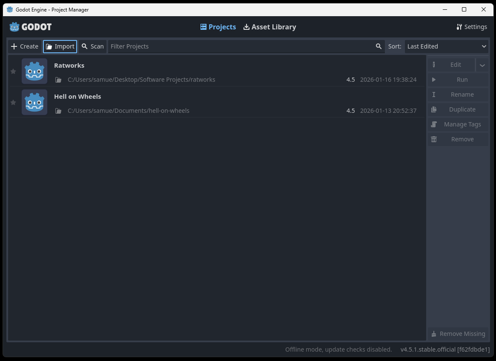

# Ratworks

## Getting Started

1. Install Godot from https://godotengine.org/download/windows/. This is the Game Engine we're using and is required to make most changes to the game.
2. Install Git from https://git-scm.com/. This is a version control system, similar to what you'd find in apps like Word, but it works on folders of files.
3. Open your Command Prompt tool of choice and run the command `git clone https://github.com/samuelhaydnarmstrong/ratworks.git`. This command fetches all the files from the Cloud and copies them to your computer.
4. Run Godot and select **Import**, select the folder that was downloaded from Git, and follow the steps to import the project.

## Running

To run the project locally follow step 1 in the deployment steps and then use the command `npm run serve`. This uses a package called Serve to run a local file server which hosts the `build` folder.

## Deploying

1. Export the project from Godot using the Web preset (without Debug) into the `build` folder. The export name should be `index` as this means it'll override what's already there, and it'll name the main file `index.html` which means it'll be the default landing page for `ratworks.co.uk` when it's deployed. If we gave it a name then we'd need to have a redirect.
2. Commit the changes to `main`.
3. Push to Github. Vercel should automatically pick up the merge and deploy it. Note that it doesn't actually use `serve` it just statically serves the files itself.
